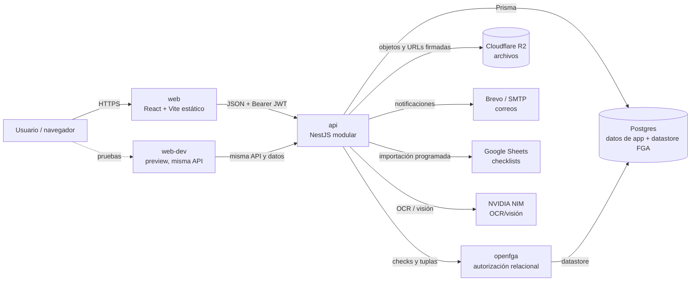
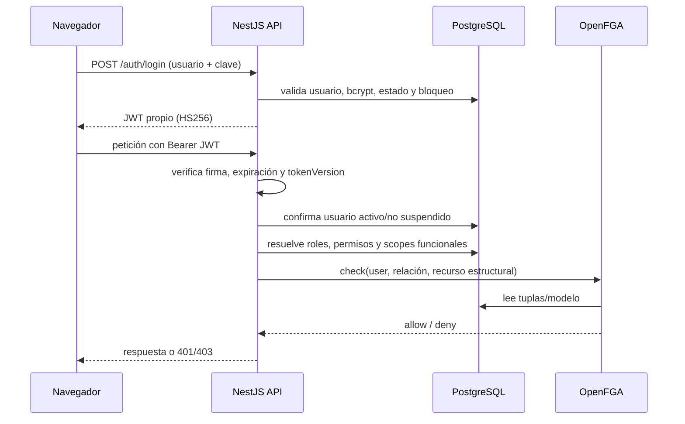

# Arquitectura y estado actual de GMT Link

**Corte de auditoría:** 31-08-2026, zona horaria America/Santiago

**Railway:** proyecto `tranquil-essence`, ambiente `production`

**Repositorio:** `japalmo/GMT-Link`

## Resumen ejecutivo

GMT Link no es hoy una arquitectura de microservicios. Es un **monolito modular**
separado físicamente en una SPA web, una API central y un servicio especializado
de autorización. Esa elección es razonable para el tamaño actual: concentra las
reglas de negocio en NestJS, mantiene un contrato tipado con el frontend y delega
solo la autorización relacional a OpenFGA.

Railway muestra nueve servicios online, pero el camino activo usa cinco:
`web`, `api`, `openfga`, `Postgres` y, para pruebas visuales, `web-dev`. Los tres
PostgreSQL adicionales y Redis no están referenciados por la configuración de la
API ni de OpenFGA. No deben eliminarse sin respaldo y confirmación, pero hoy son
candidatos claros a infraestructura huérfana.

El riesgo principal no es disponibilidad inmediata: el API y la web nativa de
Railway responden, y no aparecieron `warn`, `error` ni HTTP 5xx en los siete días
revisados. El riesgo principal es **trazabilidad**: `api` y `web` activos fueron
subidos por CLI desde un working tree sin hash de commit. El código de runtime se
recuperó y quedó versionado en `feat/fase1b-documental` (`0338073`), pero `main`
sigue en `c87b9b3` (23-07-2026).

## Fuentes y nivel de confianza

| Evidencia                                                                     | Qué demuestra                                                      | Confianza |
| :---------------------------------------------------------------------------- | :----------------------------------------------------------------- | :-------- |
| `railway status --json`, deployments, variables con valores redactados y logs | Servicios, cableado, fechas, imágenes, volúmenes y salud operativa | Alta      |
| Código, Dockerfiles, Prisma y pruebas del repositorio                         | Comportamiento de cada capa                                        | Alta      |
| Registro local de la sesión y timestamps del working tree                     | Directorio exacto desde el que se ejecutó `railway up`             | Alta      |
| Respuestas públicas de web/API y artefactos de build                          | Disponibilidad y versión distinta entre `web`/`web-dev`            | Alta      |
| Ausencia de referencias/configuración y flujos de red de Redis                | Redis no participa actualmente                                     | Alta      |
| Propósito de las tres bases adicionales                                       | No se pudo demostrar un consumidor; se consideran huérfanas        | Media     |

## Topología de producción

No se dibujan `Redis`, `Postgres-Hxm-`, `Postgres-_ig2` ni `Postgres-AQqA`
porque no tienen un vínculo de runtime demostrado.

## Inventario Railway verificado

| Servicio        | Rol real                                  | Fuente / build                                                       | Estado al corte                                   |
| :-------------- | :---------------------------------------- | :------------------------------------------------------------------- | :------------------------------------------------ |
| `web`           | Frontend productivo                       | `nodes/web/Dockerfile`; snapshot CLI del 24-08 08:47 CLT             | Online; URL Railway responde 200                  |
| `web-dev`       | Preview visual                            | Mismo Dockerfile y misma API/BD                                      | Online; bundle distinto a `web`                   |
| `api`           | Backend y reglas de negocio               | `nodes/backend-central/Dockerfile`; snapshot CLI del 24-08 08:45 CLT | Online; `/health` responde 200                    |
| `openfga`       | Motor ReBAC                               | `deploy/openfga/Dockerfile`, basado en OpenFGA                       | Online; último deploy trazable 06-07              |
| `Postgres`      | BD primaria de API y datastore de OpenFGA | Imagen Railway `postgres-ssl:18`                                     | Online; volumen 131,7/500 MB                      |
| `Redis`         | Sin consumidor configurado                | `redis:8.2.1`                                                        | Online; sin eventos de red en 7 días; 48,9/500 MB |
| `Postgres-Hxm-` | Sin consumidor demostrado                 | Imagen Railway `postgres-ssl:18`                                     | Online; 140,4/5000 MB                             |
| `Postgres-_ig2` | Sin consumidor demostrado                 | Imagen Railway `postgres-ssl:18`                                     | Online; 162,2/5000 MB                             |
| `Postgres-AQqA` | Sin consumidor demostrado                 | Imagen Railway `postgres-ssl:18`                                     | Online; 197,8/5000 MB                             |

### Endpoints

- Web productiva nativa: `https://web-production-c6320.up.railway.app`
- Web de prueba: `https://web-dev-production-05f2.up.railway.app`
- API: `https://api-production-8425d.up.railway.app`
- Health: `GET /health`
- Dominio configurado: `gmt-link.gmtingenieria.com`

El dominio personalizado no resolvió DNS durante la auditoría. La URL nativa de
Railway sí funcionó. `CORS_ORIGINS` contiene las dos URLs Railway de `web` y
`web-dev`; si se repara el dominio personalizado, también debe incorporarse a
CORS y la web debe reconstruirse con el endpoint esperado.

## Rol de cada sección del stack

### 1. Monorepo y contratos

El repositorio usa pnpm workspaces. `packages/contracts` es la frontera tipada:
define DTOs y vistas compartidas para que frontend y backend no inventen formas
distintas de los mismos datos. Los Dockerfiles lo compilan antes de construir web
o API.

`nodes/auth-service`, `nodes/tenant-gateway` y `packages/sdk-gateway` son scaffolds
de una arquitectura futura. No aparecen como servicios Railway y no deben
confundirse con el runtime actual. `nodes/v-metric` está excluido del workspace;
la funcionalidad V-Metric activa vive hoy dentro de `backend-central` y `web`.

### 2. Frontend: `nodes/web`

- React 19 + React Router: navegación SPA y guards de sesión/módulo.
- Vite: compilación y separación de chunks; `VITE_API_URL` queda horneada en el
  bundle, por lo que cambiar el API obliga a reconstruir la web.
- Tailwind/Radix/componentes propios: sistema visual y primitivas reutilizables.
- Hooks y `lib/api.ts`: cliente HTTP tipado; agrega `Authorization: Bearer <JWT>`.
- `AuthContext`: restaura la sesión desde `localStorage`, consulta `/auth/me` y
  gobierna los redirects de login, primer acceso y suspensión.

La web no es una capa de seguridad: puede ocultar módulos y acciones, pero el API
vuelve a validar cada operación.

### 3. Backend: `nodes/backend-central`

NestJS 11 concentra el dominio en módulos. Las áreas principales son:

- Identidad y personas: auth, usuarios, perfil, roles, directorio, CV y documentos.
- Operación: clientes, faenas, proyectos, servicios, tareas y documentos de proyecto.
- Finanzas: reembolsos, horas extra y liquidaciones.
- Recursos: activos, vehículos, accesorios, checklists, ciclos de uso y avisos.
- V-Metric: elementos, fases, variables, mediciones, DEM y cubicaciones.
- Soporte transversal: notificaciones, configuración, gamificación, GIS, firmas,
  almacenamiento, correo y health.

Controles globales: Helmet, CORS, límite de body, `trust proxy`, rate limit de
120 solicitudes/minuto/IP, middleware JWT y guards de autorización.

### 4. Autenticación y autorización

PostgreSQL guarda roles, catálogo de permisos, membresías y filtros `OWN`,
`PROJECT` o `GLOBAL`. OpenFGA resuelve relaciones estructurales como organización,
departamento, proyecto, servicio, documento y activo. `PermissionService` es la
fachada para decisiones finas; el `PermissionsGuard` protege rutas decoradas.

### 5. Persistencia: PostgreSQL + Prisma

Prisma define el esquema y las migraciones. PostgreSQL contiene usuarios,
clientes/faenas/proyectos, operaciones, finanzas, activos, checklists, métricas y
configuración. La misma instancia Railway `Postgres` también es el datastore de
OpenFGA según las URLs internas actuales; eso simplifica operación, pero comparte
capacidad y radio de impacto.

Al iniciar, la API ejecuta `prisma migrate deploy`, seeds idempotentes y resync de
OpenFGA. La migración es fatal; los seeds/resync están configurados como no fatales
para que un fallo secundario no impida levantar el API.

### 6. Archivos: Cloudflare R2

Los binarios no deben vivir en PostgreSQL. R2 almacena documentos, boletas,
avatares, checklists y archivos geoespaciales; la base guarda claves/metadatos.
El backend genera URLs frescas/prefirmadas y aplica autorización antes de
entregarlas.

### 7. Integraciones

- Brevo/SMTP: invitaciones, recuperación y avisos.
- Google Sheets: importación programada de checklists de vehículos.
- NVIDIA NIM: OCR y visión para boletas/documentos.
- WebAuthn: pruebas de firma verificable y credenciales de dispositivo.

### 8. Redis

Redis tiene volumen y password, pero `api` no tiene `REDIS_URL` y el backend no
declara un cliente Redis. No cumple una función actual demostrable. Puede ser un
remanente de una versión anterior o capacidad reservada.

## Cómo se construye y despliega

### API

1. Railway toma un snapshot del monorepo.
2. Docker instala Node 22, pnpm 9 y dependencias.
3. Compila contratos, genera Prisma y compila NestJS.
4. Al arrancar: migra BD, ejecuta seeds/resync y lanza `dist/main.js`.

### Web

1. Docker instala dependencias y compila contratos.
2. Vite genera archivos estáticos con `VITE_API_URL` horneada.
3. La imagen final usa `serve` con fallback SPA.

### OpenFGA

La imagen copia el binario oficial en Alpine, ejecuta migraciones y luego el
servidor. Actualmente usa la etiqueta `latest`, por lo que una reconstrucción
futura puede cambiar de versión sin que cambie Git.

## Trazabilidad Git ↔ Railway

| Elemento         | Estado                                                                     |
| :--------------- | :------------------------------------------------------------------------- |
| `main` en GitHub | `c87b9b3`, 23-07-2026; no representa producción                            |
| Rama recuperada  | `feat/fase1b-documental`, `0338073`, contiene runtime desplegado + pruebas |
| API activa       | Snapshot CLI 24-08-2026; sin `commitHash` en Railway                       |
| Web activa       | Snapshot CLI 24-08-2026; sin `commitHash` en Railway                       |
| OpenFGA activo   | Commit trazable `6a0047ab`, 06-07-2026                                     |

El commit `0338073` no cambia el runtime respecto del snapshot del 24-08 salvo por
pruebas: versiona los seis archivos/migración que estaban modificados antes de
ejecutar `railway up`. Para cerrar la brecha se debe integrar la rama, volver a
desplegar desde un commit y verificar que Railway registre ese hash.

## Riesgos y prioridades

| Prioridad | Hallazgo                                                               | Acción recomendada                                                          |
| :-------- | :--------------------------------------------------------------------- | :-------------------------------------------------------------------------- |
| P0        | `main` no representa producción y los últimos deploys no tienen commit | PR de esta rama hacia `main`; luego deploy desde GitHub/commit inmutable    |
| P0        | El token de Railway fue compartido en una conversación                 | Rotarlo y reemplazar cualquier uso local/automatizado                       |
| P1        | Dominio personalizado sin DNS                                          | Corregir CNAME/target, validar TLS, agregar dominio a CORS y smoke test     |
| P1        | Tres PostgreSQL y Redis sin consumidor demostrado                      | Identificar owner/datos, respaldar y recién entonces pausar/eliminar        |
| P1        | `web-dev` comparte API y BD productivas                                | Crear ambiente staging con API/BD propias antes de pruebas destructivas     |
| P1        | App y OpenFGA comparten instancia PostgreSQL                           | Asegurar backups/PITR y evaluar datastore separado por radio de impacto     |
| P2        | Railway no tiene healthcheck path configurado                          | Configurar `/health` en `api` y un check HTTP simple en `web`               |
| P2        | OpenFGA usa `latest`                                                   | Fijar una versión/digest probado                                            |
| P2        | Docker usa `pnpm install` y `pnpm@9` flotante                          | Fijar versión exacta y usar `--frozen-lockfile`                             |
| P2        | `web` y `web-dev` sirven bundles distintos                             | Definir qué commit promueve cada uno y mostrar versión en la UI/health      |
| P2        | Harness backend no está completamente verde                            | Corregir 7 errores de typecheck, 3 expectativas de tareas y aislar test FGA |

## Validación realizada

- API `/health`: 200.
- Web nativa Railway: 200.
- Dominio personalizado: fallo DNS.
- Logs de `api`/`web`, últimos 7 días: sin `warn`, `error` ni HTTP 5xx devueltos.
- Prisma schema: válido.
- Build de backend: correcto.
- Build de web: correcto.
- Contratos: 5/5 tests.
- Web: 172/172 tests.
- Suites afectadas del backend: 63/63 tests.
- Backend Vitest amplio: 1290 pasan, 3 fallan por expectativas antiguas de
  `completedAt`; 28 tests FGA se omiten y la suite de integración requiere un
  OpenFGA local.
- `backend test` completo se detiene antes de Vitest por 7 errores de typecheck
  preexistentes en mocks/imports de pruebas de activos y usuarios.

## Secuencia recomendada para normalizar

1. Rotar el token Railway compartido.
2. Revisar y fusionar la rama de auditoría a `main`.
3. Desplegar `api` y `web` desde el commit fusionado, no desde un working tree.
4. Ejecutar smoke tests de login, proyectos, documentos, activos y `/health`.
5. Reparar DNS y configurar healthchecks.
6. Crear staging aislado.
7. Respaldar y retirar solo la infraestructura huérfana confirmada.
8. Dejar CI obligatorio para build, contratos, web y backend.
